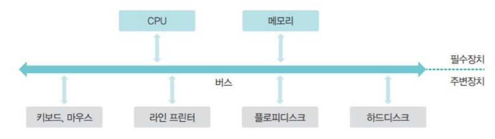
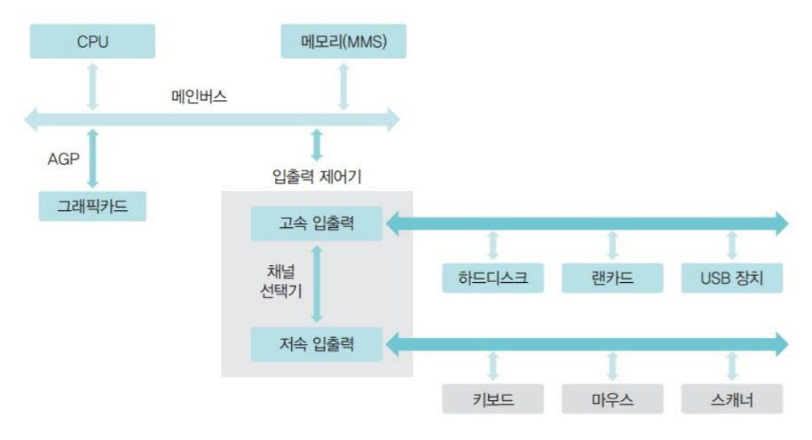
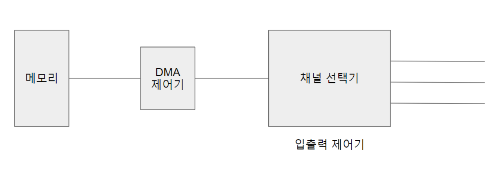
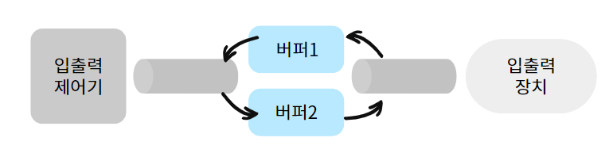
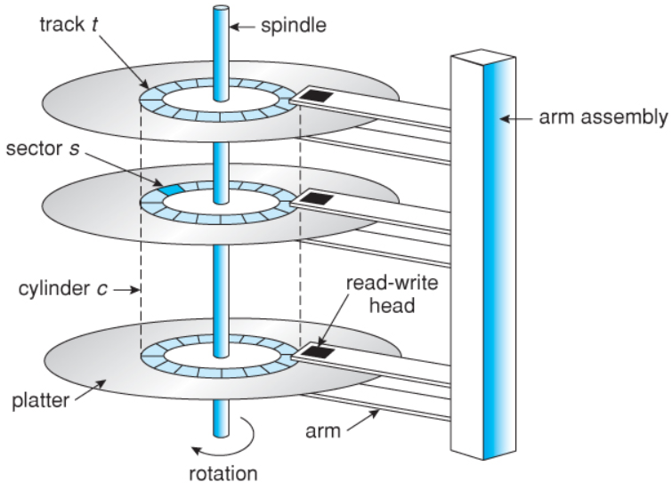
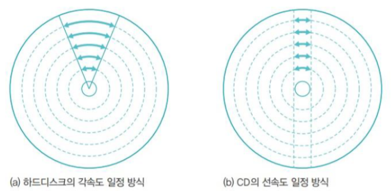
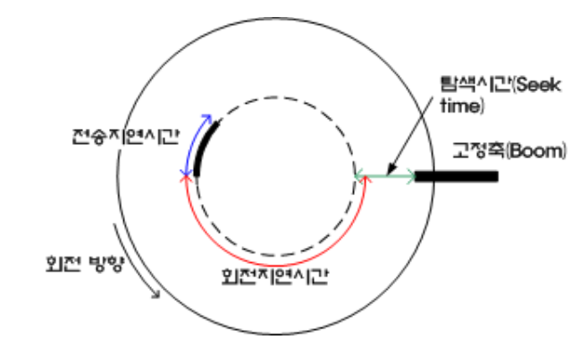
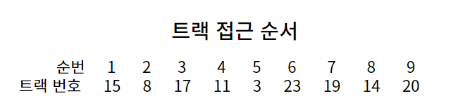

# 입출력 시스템과 디스크 관리

## 입출력 시스템

### 입출력 장치와 채널

컴퓨터에는 필수 장치(CPU, 메모리)와 주변장치(입출력장치, 저장장치)로 구성된다. 다양한 주변장치는 데이터 전송 속도에 따라 **저속 주변장치**와 **고속 주변장치**로 구분된다. 각 장치는 메인 보드에 있는 버스로 연결된다.

- **저속 주변장치**: 메모리와 주변장치 사에이 오고 가는 데이터 양이 적어 데이터 전송률이 낮은 장치. ex) 키보드, 마우스, 스캐너
- **고속 주변장치**: 메모리와 주변장치 사에이 오고 가는 데이터 양이 많아 데이터 전송률이 높은 장치. ex) 그래픽 카드(초당 수집장의 그래픽을 보여주어야 함)

버스는 여러 개의 버스를 묶어서 사용한다. 그 통로를 **채널**이라고 한다. 여러 채널을 효율적으로 사용하기 위해 전송 속도가 비슷한 장치끼리 묶어서 채널을 할당한다.

 

### 입출력 버스의 구조

#### 폴링 방식(초기 구조)

초기에는 모든 장치가 하나의 버스로 연결되고, CPU가 작업을 진행하다가 입출력 명령을 만나면 직접 입출력 장치에서 데이터를 가져왔는데 이를 **폴링(polling) 방식**이라고 한다.

- 폴링 방식: 하드웨어 상태를 수시로 체크하여 명령을 받을 수 있는지 확인

그러나 주변 장치는 CPU와 메모리보다 매우 느리다. 따라서 폴링 방식을 사용하면 CPU 대기 시간이 길어져 작업의 속도가 매우 느려진다.

#### 입출력 제어기를 사용한 구조

CPU와 메모리 성능이 향상되고, 주변 장치 종류가 다양해졌다. 폴링 방식의 한계 때문에 모든 입출력을 **입출력 제어기(I/O Controller)에** 맡기는 구조로 바뀌었다.

입출력 제어기는 2개의 채널로 나뉜다. **메인버스**는 고속으로 작동하는 CPU와 메모리를, **입출력 버스**는 주변장치가 사용한다. 입출력 버스는 다시 **고속 입출력 버스**와 **저속 입출력 버스**로 분리해서 운영한다. (두 버스 사이의 데이터 전송은 채널 선택기가 관리)

이로인해 폴링 방식의 단점을 해결하여 전체 작업 효율이 향상된다.

### 직접 메모리 접근

직접 메모리 접근(DMA)은 CPU의 도움 없이 메모리에 접근할 수 있도록 입출력 제어기에 부여된 권한이다. 입출력 제어기에는 직접 메모리에 접근하기 위한 **DMA 제어기**가 마련되어 있다.

입출력 제어기의 채널 선택기가 여러 채널에서 전송 받은 데이터 중 어떤 것을 메모리로 보낼지 정하고, 전송된 데이터는 DMA 제어기를 거쳐 메모리에 올라간다.

반대로 메모리에서 주변장치로 데이터를 전송할 때는 DMA 제어기가 메모리에서 데이터를 가져오면 채널 선택기에서 적당한 채널로 전송한다.

### 인터럽트

인터럽트는 입출력 제어기가 주변장치의 입출력 요구나 하드웨어 이상 현상을 CPU에 알려주는 역할을 하는 신호다.

ex) CPU가 요청 한 작업을 완료했을 때, 키보드로 데이터를 입력받았을 때, 네트워크 카드에 새로운 데이터가 도착했을 때, 하드웨어에 이상이 생겼을 때.

CPU는 인터럽트를 받아도 어떤 장치의 인터럽트인지 확인하기 어렵다. 따라서 각 장치에는 **IRQ**라는 고유의 인터럽트 번호가 부여되어 있고, IRQ를 통해 CPU는 어떤 장치에서 발생한 인터럽트인지 파악한다.

- 외부 인터럽트: 입출력 및 하드웨어 관련 인터럽트(ex. 전원 이상, 기계적 오류)
- 내부 인터럽트: 프로세스의 오류로 발생하는 인터럽트(ex. 숫자 0으로 나누기, 주소공간 벗어나는 작업하기)
- 시그널: 사용자의 요청으로 발생하는 인터럽트(ex. 리눅스에서 ctrl + c로 작동중인 프로세스 끝내기)

### 버퍼링

버퍼는 속도가 다른 두 장치의 속도 차이를 완화하는 역할을 한다. 입출력 장치는 느린 장치를 통해 들어오는 데이터를 버퍼에 모아 한꺼번에 이동시켜 느린 속도를 보완한다.

 이 때 단일 버퍼 대신 이중 버퍼를 사용하여 한 버퍼는 데이터를 담는 용도로 쓰고 다른 버퍼는 데이터를 가져가는 용도로 쓴다.

시스템 효율성을 위해 운영체제에서는 버퍼가 가득 찼을 때 입출력장치로 데이터를 전송하도록 설계되어 있다. 이러한 특성 때문에 외부 저장 장치를 제거하거나 파일 입출력 시 버퍼에만 있고 저장장치에는 반영되지 않는 경우가 생길 수 있다.

 

---

 

## 디스크 관리

최근에는 메모리 가격이 많이 낮아져 USB 메모리나 SSD 같은 반도체를 이용한 저장 장치가 많이 보급되었다. 하지만 여전히 대용량 데이터 저장을 위해 하드디스크(Hard Disk Drive, HDD)를 많이 사용한다. 
- 하드디스크 : 움직이는 헤드를 가진 하드디스크 드라이브

### 하드 디스크 구조

하드디스크는 스핀들(spindle)이라는 원통 축에 여러 개의 플래터(platter)가 달려있는 구조이다.

- 플래터 : 표면에 자성체가 발려 있어 자기를 이용하여 0과 1의 데이터를 저장. 항상 일정한 속도로 회전함. (일반적으로 일반 컴퓨터에는 3.5인치를 노트북에는 2.5인치를 사용)
- 섹터: 물리적 개념. 하드디스크의 가장 적은 저장 단위.
- 블록 : 논리적 개념. 하드디스크와 컴퓨터 사이에 데이터를 저장하는 논리적 저장 단위 중 가장 작은 저장 단위
- 트랙: 플래터에서 회전축을 중심으로 데이터가 기록되는 동심원(섹터의 집합)
- 실린더: 여러 개의 플래터에 있는 같은 트랙의 집합
- 헤드: 데이터를 읽거나 쓸 때 사용하는 부위

하드디스크는 구조상 외부 충격에 민감하다.

* 각속도 일정 방식의 회전 : 일정한 시간 동안 이동한 각도가 같다.

하드디스크의 플래터는 항상 일정한 속도로 회전하여 바깥쪽 트랙의 속도가 안쪽 트랙의 속도보다 훨씬 빠르다.

### 디스크의 데이터 전송 시간

- 탐색 시간: 헤드가 특정 섹터의 트랙까지 이동하는데 걸리는 시간
- 회전 지연 시간: 플래터가 회전하여 원하는 섹터를 만날 때 까지 걸리는 시간
- 전송 시간: 헤드가 섹터에 있는 데이터를 읽어 전송하는 시간

데이터 전송 시간 = 탐색 시간 + 회전 지연 시간 + 전송 시간

 

---

 

### 디스크 스케줄링

디스크는 매우 느리지만 자주 사용하는 저장장치이다. 디스크의 데이터 전송 시간 중에는 탐색 시간이 가장 느리다. 디스크 스케줄링(disk scheduling)은 트랙의 이동을 최소화하여 이 탐색 시간을 줄이는데 목적이 있다.

#### FCFS 디스크 스케줄링
- 15 -> 8 -> 17 -> 11 -> 3 -> 23 -> 19 -> 14 -> 20 (이동 거리 65)
- 가장 단순한 디스크 스케줄링 방식으로, 요청이 들어온 트랙 순서대로 서비스 

#### SSTF(Shortest Seek Time First) 디스크 스케줄링
- 15 -> 14 -> 17 -> 19 -> 20 -> 23 -> 11 -> 8 -> 5 (이동 거리 31)
- 현재 헤드가 있는 위치에서 가장 가까운 트랙부터 서비스
- 만약 다음에 서비스할 두 트랙의 거리가 같다면 먼저 요청받는 트랙을 서비스
- 효율성은 좋지만 아사 현상을 일으킬 수 있음. 헤드가 중간에 위치하면 가장 안쪽이나 바깥쪽에 갈 확률이 적어짐

#### 블록 SSTF 스케줄링
- 15 -> 17 -> 8 -> 11 -> 3 -> 23 -> 20 -> 19 -> 15 (이동 거리 51)
- 위의 공평성 위배를 어느 정도 해결한 방법
- 블록 단위로 트랙을 관리하여 멀리 있는 트랙도 몇 번만 양보하면 서비스 받을 수 있음(에이징 적용)
- FCFS 보다 성능이 좋지 않음

#### SCAN 디스크 스케줄링
- 15 -> 14 -> 11 -> 8 -> 3 -> 0 -> 17 -> 19 -> 20 -> 23 (이동 거리 38)
- SSTF의 공평성 위배 문제를 완화하기 위해 만들어진 기법
- 헤드가 한 방향으로만 움직이며 서비스를 함. 맨 마지막 트랙에 도착할 때까지 뒤돌아가지 않음
- SSTF 보다 성능이 조금 떨어지지만 FCFS 보다 성능이 좋음
- 가장 많이 사용되는 기법 중 하나. 그러나 동일한 트랙의 요청이 연속적으로 발생되면 헤드가 더 이상 나아가지 못해 바깥쪽 트랙이 아사 현상을 겪는 문제 발생

#### C-SCAN 디스크 스케줄링
- 15 -> 14 -> 11 -> 8 -> 3 -> 0 -> (작업없이 이동) -> 24 -> 23 -> 20 -> 19 -> 17 (이동 거리 46)
- SCAN 스케줄링처럼 한 방향으로 움직이며 서비스 하지만 마지막 트랙에 도착하면 다시 처음으로 돌아감
- 모든 트랙이 공평하게 서비스 받음. 그러나 작업 없이 헤드를 이동하여 매우 비효율적

#### LOOK 디스크 스케줄링
- 15 -> 14 -> 11 -> 8 -> 3 -> 17 -> 19 -> 20 -> 23 (이동 거리 35)
- 더 이상 서비스할 트랙이 없으면 헤드가 끝가지 가지 않고 중간에서 방향을 바꿈

#### C-LOOK 디스크 스케줄링
- 15 -> 14 -> 11 -> 8 -> 3 -> (작업없이 이동) -> 23 -> 20 -> 19 -> 17(이동 거리 38)
- C-SCAN의 LOOK 버전

#### SLTF(Shortest Latency Time First) 디스크 스케줄링

- 최소 지연 우선 기법(헤드 이동 시간이 아닌 회전 지연 시간을 최적화)
- 작업 요청이 들어온 섹터의 순서를 디스크가 회전하는 방향에 맞추어 다시 정렬
